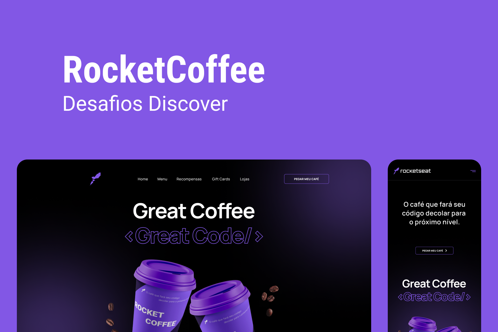

    

  <a href="#-Objetivo"> Objetivo</a>&nbsp;&nbsp;&nbsp;|&nbsp;&nbsp;&nbsp;
  <a href="#-Tecnologias"> Tecnologias </a>&nbsp;&nbsp;&nbsp;|&nbsp;&nbsp;&nbsp;
  <a href="#-Desafio-Marmitech-da-Jake">  Desafio </a>&nbsp;&nbsp;&nbsp;|&nbsp;&nbsp;&nbsp;
  <a href="#-Funcionalidade-extra">  Funcionalidade Extra </a>&nbsp;&nbsp;&nbsp;|&nbsp;&nbsp;&nbsp;

## 🎉  Objetivo
Neste desafio você deverá desenvolver uma homepage para uma marca de café. Você pode consultar o site nesse [link](https://rocketcoffee-seven.vercel.app/)

## 🔩 Tecnologias
- [X] HTML5
- [X] TailwindCSS
- [X] JavaScript
## 🥗 Desafio Marmitech da Jake
1. Escolha um desafio da RocketSeat ou da DevChallenge
2. Adicionar uma funcionalidade
3. Fazer um Post no Linkedin dizendo:
    - Qual funcionalidade adicionei
    - O que entrego pro mercado que não é uma skil técnica
4. Link do artigo e do Github do projeto

## 🧱 Funcionalidades Extras
- [X] Modal com formulário de entrega
- [X] Notificação de entrega do Café nas informações colocadas no formulário